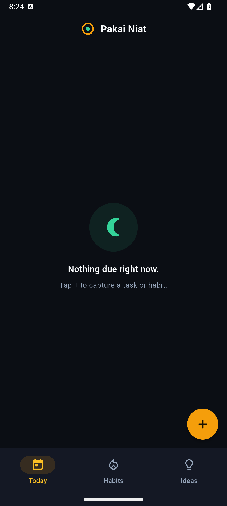
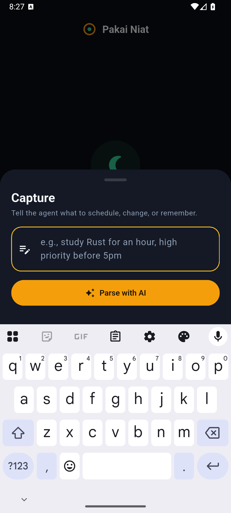
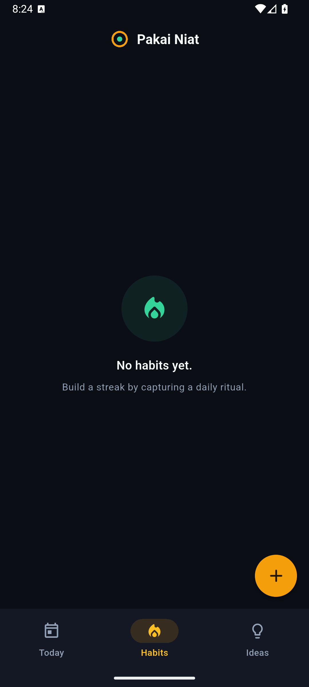
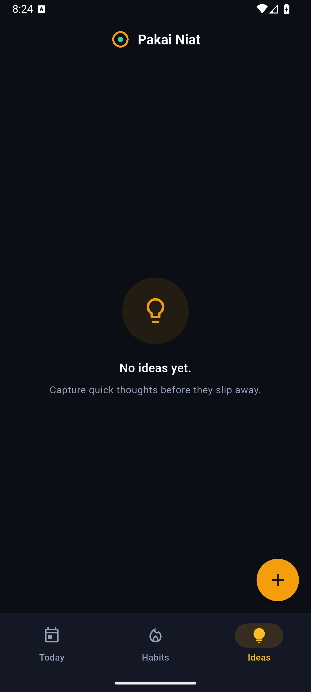

<div align="center">


# Pakai Niat

**Say it. Mean it. Do it.**

An AI-native habit & task companion. Capture intentions in plain words — the AI catalogs them into tasks, habits, and ideas. Local-first, private, open source.

[](https://github.com/Gr3gg0r/pakai-niat/actions/workflows/ci.yml)
[](LICENSE)
[](https://flutter.dev)

[Landing page](https://gr3gg0r.github.io/pakai-niat/) · [Report a bug](https://github.com/Gr3gg0r/pakai-niat/issues/new?template=bug_report.md) · [Request a feature](https://github.com/Gr3gg0r/pakai-niat/issues/new?template=feature_request.md)

</div>

---

> **niat** · /nee-aht/ — Malay for *intention*: the thing you mean to do before life gets in the way.
> "Pakai niat" is what your mother says when "I'll do it later" stops working: **use your intention**.

## Screenshots

<p align="center">
  
  
  
  
</p>

## Why

Most planners are Gantt charts squeezed onto a phone screen — sixteen-field dialogs, passive logs, zero accountability. Pakai Niat is the opposite: **one text box, one calm column, honest data**.

- **Capture in plain words** — "maghrib at the mosque every day" or "finish report before 5pm, high priority". The AI (via OpenRouter) returns structured create/update/delete operations you approve with one tap.
- **Habits with real stakes** — streaks increment once per day (no double-tap cheating), and the Miss button actually logs the miss. Honest data beats flattering data.
- **Priorities that infer themselves** — "urgent", "before Friday prayers", "after work" become real priority levels and ISO timestamps.
- **Local-first & private** — everything lives in an on-device Isar database. No account, no cloud, no analytics. The AI only ever sees the sentence you typed.
- **Bring your own brain** — runs on OpenRouter's free model router. No subscription, no credit card.

## Quick start

Prerequisites: [Flutter](https://docs.flutter.dev/get-started/install) (stable), and a free [OpenRouter](https://openrouter.ai) API key.

```bash
git clone https://github.com/Gr3gg0r/pakai-niat.git
cd pakai-niat
flutter pub get
cp .env.example .env        # then paste your key into .env
flutter run                 # pick a device or emulator
```

No key handy? The app still runs — capture falls back to a clear in-app message, and you can save raw text as an Idea.

## How it works

```
┌─────────────┐    plain words     ┌──────────────┐   structured ops   ┌─────────────┐
│  Capture UI │ ─────────────────▶ │  OpenRouter  │ ────────────────▶  │   Preview   │
└─────────────┘                    │ (free router)│                    │  & Apply    │
                                   └──────────────┘                    └──────┬──────┘
                                                                              │ Isar txn
                                                                              ▼
┌─────────────┐    reactive streams                                  ┌─────────────┐
│ Today /     │ ◀─────────────────────────────────────────────────── │  Local DB   │
│ Habits /    │                                                      │  (on-device)│
│ Ideas       │                                                      └─────────────┘
└─────────────┘
```

The LLM never blocks the UI. Every mutation commits to Isar first; views react to database streams.

## Project layout

```
lib/
  models/      Isar collections (Task, Habit, Idea, HabitLog, InboxCapture)
  services/    OpenRouterParser, CatalogService (all mutations)
  providers/   Riverpod providers bridging Isar streams to UI
  views/       Splash, Home (Today / Habits / Ideas), Capture sheet
test/          Unit + widget tests (27 and counting)
site/          Static landing page (deployed to GitHub Pages)
```

## Tech stack

| Layer | Choice | Why |
|---|---|---|
| Framework | Flutter | One codebase, every screen |
| State | Riverpod | Unidirectional, testable |
| Storage | Isar | Local-first, reactive streams |
| AI | OpenRouter (`openrouter/free`) | Free model router, strict JSON output |
| HTTP | dio | Typed, interceptable |

## Development

```bash
flutter analyze              # must stay clean
flutter test                 # all tests must pass
dart run build_runner build -d   # regenerate Isar code after model changes
```

See [CONTRIBUTING.md](CONTRIBUTING.md) for the full workflow.

## License

[AGPL-3.0](LICENSE) — free to use, study, and modify. If you run a modified version as a service, you must share your changes. That's the deal.
